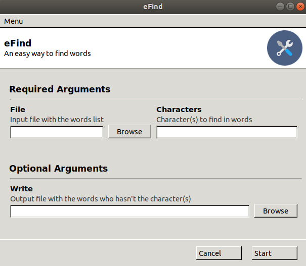
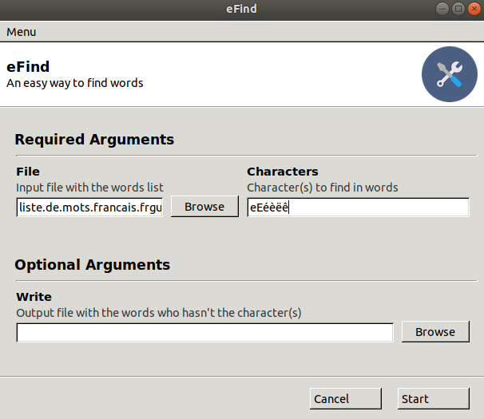
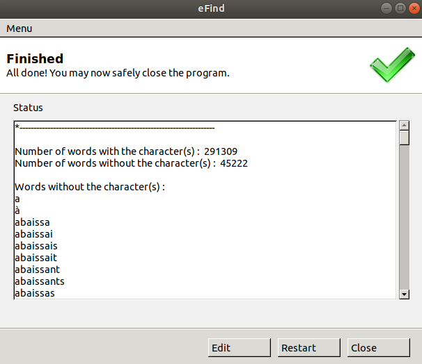

# eFind

eFind est un outil *user friendly* sous forme d'interface graphique offrant la possibilité de :

- compter le nombre de mots d'une liste présentant et ne présentant pas au moins un ou des caractères spécifiques préalablement définis par l'utilisateur
- retourner les mots ne disposant pas d'au moins un ou des caractères soit, par défaut, dans la fenêtre graphique soit dans un fichier de sortie déterminé par l'utilisateur


<p align="center">
    
</p>


## Table des matières

- [eFind](#efind)
  * [Table des matières](#table-des-matières)
  * [Contexte](#contexte)
  * [Pour commencer](#pour-commencer)
    + [Pré-requis](#pré-requis)
    + [Installation](#installation)
  * [Démarrage et utilisation](#démarrage-et-utilisation)
  * [Fabriqué avec](#fabriqué-avec)
  * [Information complémentaire](#information-complémentaire)
  * [Auteur](#auteur)

## Contexte

[La Disparition](http://www.gallimard.fr/Catalogue/GALLIMARD/L-Imaginaire/La-disparition) de Georges Perec est un réel chef d'oeuvre de la littérature française. Sur plus de 300 pages comportant 78000 mots[^1], le roman ne contient pas une seule fois la lettre *e*. Pourtant, celle-ci a la fréquence d'apparition la plus élévée dans la langue française[^2]. 

Malgré cette impressionnante contrainte d'écriture, Perec n'a eu besoin que d'une année pour écrire ce roman. Dans une archive, l'auteur expliquait le processus utilisé pour faciliter l'élaboration du livre[^3] : 

> C'est un travail, on commence par faire un dictionnaire en prenant tous les verbes comme "parcourir", "courir", "mourir"... pas "sourire", parce qu'il y a un "e", mais plutôt "il sourit". [Georges Perec, Panorama, 13 juillet 1988]

A l'air des nouvelles technologies, eFind propose d'imiter ce processus de façon automatisée, rapide et reproductible.

## Pour commencer

### Pré-requis

Il est requis pour commencer avec le projet :

- python 3
- [Gooey](https://github.com/chriskiehl/Gooey)
- une liste de mots (fournie)

### Installation

Tout d'abord, le projet git doit être cloné dans le répertoire local de votre ordinateur

```bash
git clone https://github.com/srh-bzd/eFind.git
```

Puis, dans le répertoire local, autoriser l'exécution du script `efind.py`

```bash
chmod +x efind.py
```

## Démarrage et utilisation

Pour lancer l'outil, la commande suivante doit être tapée dans le répertoire local où se trouve le script `efind.py`

```bash
python3 efind.py
```

Une fois l'interface graphique apparue, dans la section *Required Arguments*, charger le fichier contenant la liste de mots à parcourir à l'aide du bouton *browse* et rentrer le(s) caractère(s) à rechercher.

<p align="center">
    
</p>


Par défaut, la liste de mots ne comportant pas le(s) caractère(s) entré(s) apparaît dans l'interface graphique. Pour qu'elle soit écrite dans un fichier de sortie, dans la section *Optional Arguments*, indiquer le fichier à l'aide du bouton *browse*.

<p align="center">
    
</p>


Enfin, exécuter la recherche avec le bouton *start*.

<p align="center">
    
</p>


## Fabriqué avec

- [Ubuntu](https://releases.ubuntu.com/) 18.04 LTS - Système d'exploitation
- [Visual Studio Code](https://code.visualstudio.com/) 1.45.1 - Editeur de codes
- [Miniconda3](https://docs.conda.io/en/latest/miniconda.html) 4.8.2 - Gestionnaire de paquets

## Information complémentaire

La liste de mots fournie provient du blog de [Chrisophe Pallier](http://www.pallier.org/liste-de-mots-francais.html). Cette liste a été choisie car elle semble la plus exhaustive, notamment parce qu'elle contient noms et adjectifs partant du féminin singulier (et non du masculin singulier) et verbes conjugués. La liste a été produite à partir du dictionnaire [Francais-Gutenberg](http://www.fifi.org/doc/ifrench-gut/fr/reference.pdf.gz).

## Auteur

- Sarah Bouzidi


[^1]: https://associationgeorgesperec.fr/IMG/pdf/HERMES_SALCEDA.pdf
[^2]: https://fr.wikipedia.org/wiki/Fr%C3%A9quence_d%27apparition_des_lettres_en_fran%C3%A7ais#cite_note-1
[^3]: https://www.franceculture.fr/litterature/le-jour-sans-e
